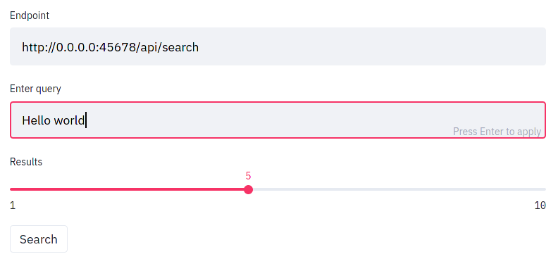
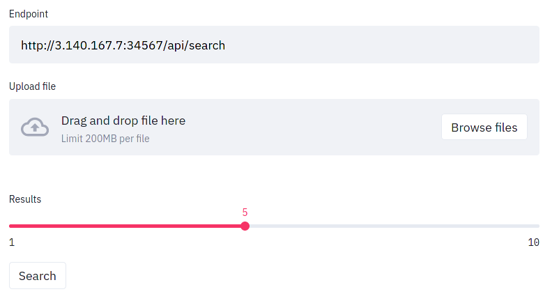

# streamlit-jina

<!--


[](https://share.streamlit.io/randyzwitch/streamlit-jina/examples/streamlit_app.py)
-->

streamlit-jina lets you search text or images in your Streamlit app, using [Jina's neural search framework](https://github.com/jina-ai/jina/).

## Installation

streamlit-jina is distributed via [PyPI](https://pypi.org/project/streamlit-jina/):

```python
pip install streamlit-jina
```

## Examples

Using streamlit-jina is as simple as setting an endpoint and what type of thing you want to search for:

```python
import streamlit as st
from streamlit_jina import jina
```

And then choose your search type and plug in your endpoint:

### Text ([example](examples/jina_text.py))

```python
jina.text_search(endpoint="http://0.0.0.0:45678/api/search")
```

<!--  -->

### Images ([example](examples/jina_image.py))

```python
jina.image_search(endpoint="http://3.140.167.7:34567/api/search")
```

<!--  -->

### Parameters

You can pass several parameters to the component:

| Parameter  | Type   | Details                                                 |          |
| ---        | ---    | ---                                                     | ---      |
| `endpoint` | `str`  | Endpoint of your Jina instance                          | Required |
| `top_k`    | `int`  | How many results you want returned                      | Optional |
| `hidden`   | `list` | Widgets you want hidden from user (`endpoint`, `top_k`) | Optional |

## Todo

- Canvas drawing as input
- Audio/video file upload input
- Audio/video recording input
- Audio/video output widgets
